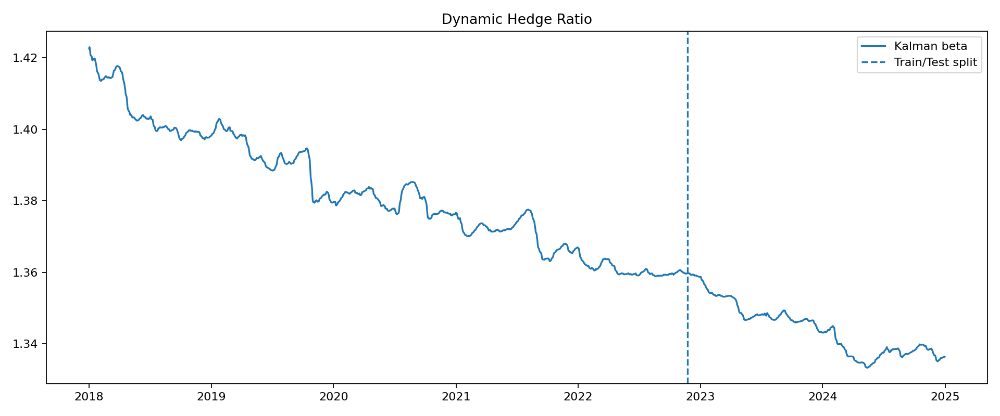
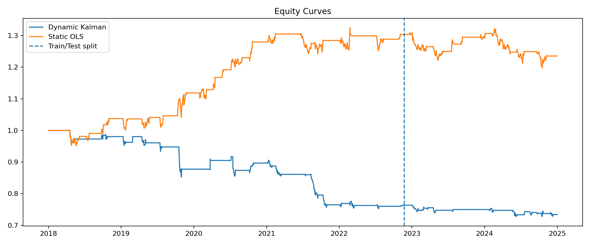
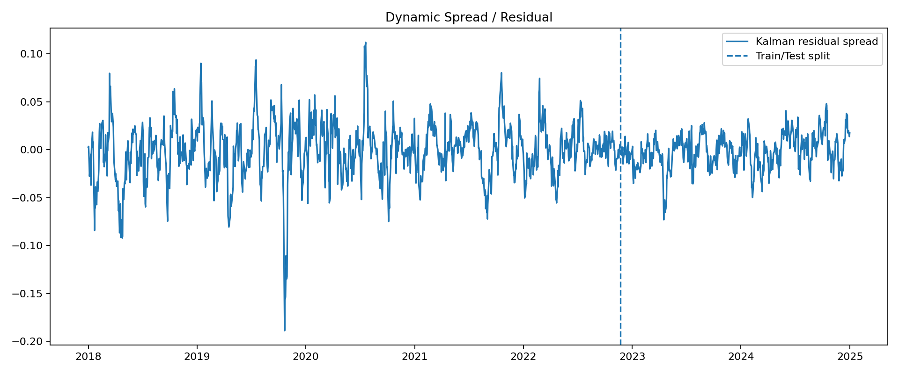
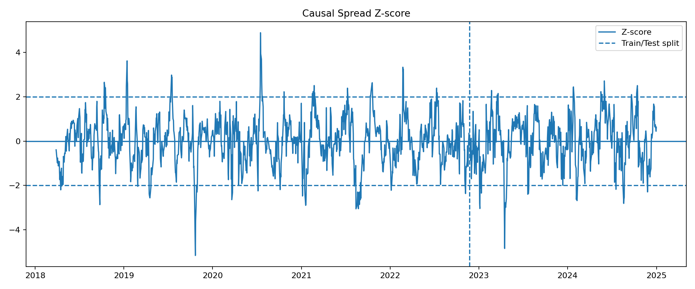
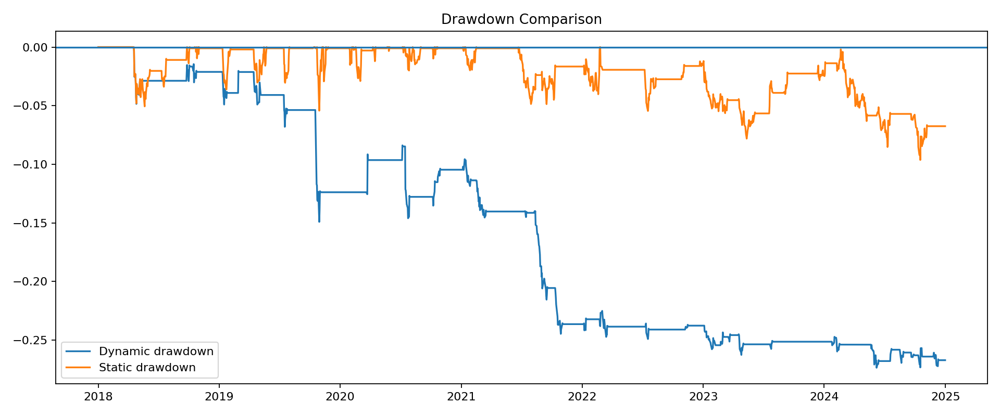
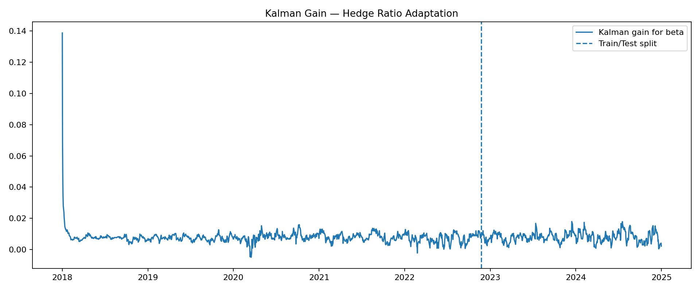

# Dynamic Statistical Arbitrage — Kalman Filter Hedge Ratio

**Quantitative / Statistical-Arbitrage Research Project**

A causal, execution-aware pairs-trading framework that uses a Kalman filter to recursively estimate a time-varying hedge ratio and compares it with a static OLS hedge under the same out-of-sample trading conditions.

> **Scope:** This project uses daily equity data. It is not presented as an HFT trading system because the dataset does not contain tick data, order-book information, queue position, exchange latency, or fill data. Instead, it focuses on quantitative ideas relevant to HFT and quantitative-research interviews: state-space modeling, recursive estimation, market-neutral construction, execution timing, transaction costs, risk controls, and rigorous out-of-sample testing.

---

## Research Question

A traditional pairs-trading model assumes a fixed relationship:

\[
y_t = \alpha + \beta x_t + \epsilon_t
\]

where the hedge ratio \(\beta\) is estimated using OLS.

This relationship may change over time as market conditions, relative volatility, and the underlying economics of the securities change.

The main question investigated here is:

> **Can a recursively estimated hedge ratio adapt to a changing relationship without using future information, and does that adaptation remain useful after execution costs and risk controls?**

The model therefore treats the intercept and hedge ratio as time-varying hidden states:

\[
\theta_t =
\begin{bmatrix}
\alpha_t \\
\beta_t
\end{bmatrix}
\]

and updates them recursively using a Kalman filter.

The goal is to test the idea rigorously rather than assume that a more sophisticated model automatically produces better returns.

---

## Results

The strategy is evaluated on a chronological out-of-sample test period.

**Test period:** 2022-11-23 → 2024-12-31  
**Observations:** 519

| Metric | Dynamic Kalman | Static OLS |
|---|---:|---:|
| Total Return | -3.87% | -5.22% |
| CAGR | -1.90% | -2.57% |
| Annualized Volatility | 3.69% | 5.66% |
| Sharpe Ratio | -0.50 | -0.43 |
| Sortino Ratio | -0.42 | -0.51 |
| Maximum Drawdown | -4.71% | -9.45% |

The dynamic strategy was not profitable out of sample.

The result is retained rather than changing parameters simply to obtain a better Sharpe ratio. In this experiment, the dynamic hedge reduced volatility and maximum drawdown relative to the static benchmark, but did not produce positive out-of-sample returns.

---

## Research Outputs

### Dynamic Hedge Ratio



### Equity Curve



### Dynamic Spread



### Z-Score



### Drawdown



### Kalman Gain



---

## 1. Mathematical Model

### Observation Equation

The relationship is modeled using log prices:

\[
\log Y_t = \alpha_t + \beta_t\log X_t + \epsilon_t
\]

where

\[
\epsilon_t \sim N(0,R)
\]

or, in state-space form,

\[
y_t = H_t\theta_t + \epsilon_t
\]

with

\[
H_t =
\begin{bmatrix}
1 & x_t
\end{bmatrix}
\]

and

\[
\theta_t =
\begin{bmatrix}
\alpha_t \\
\beta_t
\end{bmatrix}.
\]

The hidden state therefore contains the dynamic intercept and hedge ratio.

### State Transition

The coefficients follow a random-walk process:

\[
\theta_t = \theta_{t-1} + \eta_t
\]

where

\[
\eta_t \sim N(0,Q).
\]

Here:

- \(Q\) controls how quickly the coefficients are allowed to evolve.
- \(R\) represents observation noise.
- The Kalman gain controls how strongly each new observation updates the previous state estimate.

---

## 2. Dynamic Spread

The dynamically estimated residual is:

\[
s_t =
\log Y_t -
\alpha_t -
\beta_t\log X_t
\]

Trading signals are generated from a causal trailing z-score of this residual.

The important distinction is that the spread is constructed using the **current filtered state**, rather than a hedge ratio estimated once over the entire sample.

---

## 3. Research Pipeline

```text
Raw Prices
    ↓
Training-Only Pair Selection
    ↓
Training-Only OLS Initialization
    ↓
Training-Only Q/R Calibration
    ↓
Recursive Kalman Filtering
    ↓
Dynamic α_t, β_t
    ↓
Dynamic Residual Spread
    ↓
Trailing Z-Score
    ↓
Signal at t
    ↓
Execute at t+1
    ↓
Dynamic Hedge Weights
    ↓
Turnover + Transaction Costs + Slippage
    ↓
Risk / P&L / Drawdown
    ↓
Untouched Out-of-Sample Evaluation
